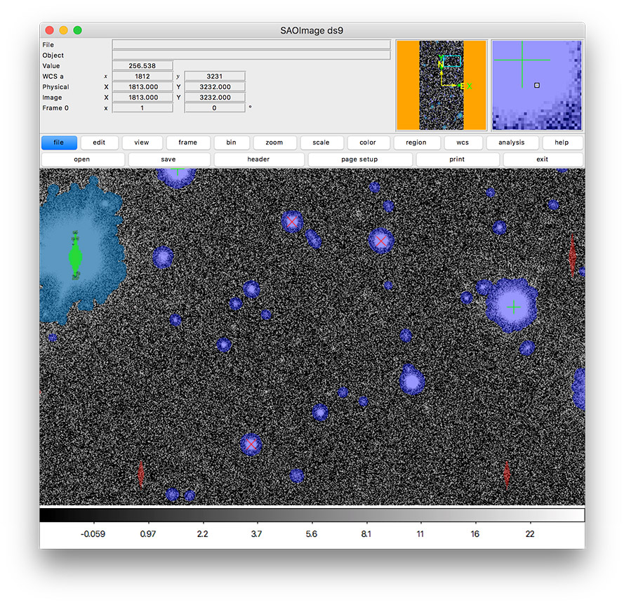

..
  Brief:
  This tutorial is geared towards new users of the Science Pipelines software.
  Our goal is to guide the reader through a small data processing project to show what it feels like to use the Science Pipelines.
  We want this tutorial to be kinetic; instead of getting bogged down in explanations and side-notes, we'll link to other documentation.
  Don't assume the user has any prior experience with the Pipelines; do assume a working knowledge of astronomy and the command line.

#########################################################################################################
Getting started tutorial part 3: displaying exposures and source tables output by single frame processing
#########################################################################################################

In the :doc:`previous tutorial <singleframe>` in the :ref:`series <getting-started-tutorial>` you used :command:`pipetask run` configured appropriately to execute the ``singleFrame`` pipeline to calibrate a set of raw Hyper Suprime-Cam images.
Now you'll learn how to use the LSST Science Pipelines to inspect those outputs by displaying images and source catalogs in the `DS9 image viewer`_.
In doing so, you'll be introduced to some of the LSST Science Pipelines' Python APIs, including:

- Accessing datasets with the Butler.
- Displaying images in DS9 with ``lsst.afw.display``.
- Working with source catalogs using ``lsst.afw.table``.

   In this tutorial, you'll create an image display like this one that includes mask planes and source markers.

Set up
======

Pick up your shell session where you left off in :doc:`part 2 <singleframe>`.
For simplicity, the following examples assume your current working directory  *contains* the :file:`SMALL_HSC` directory (the Butler repository).

.. code:: bash

   cd $RC2_SUBSET_DIR

The ``lsst_distrib`` package also needs to be set up in your shell environment.
See :doc:`/install/setup` for details on doing this.

You'll also need to `download and install the DS9 image viewer`_.

Launch DS9 and start a Python interpreter
=========================================

In this tutorial, you will use an interactive Python session to control DS9.
You can also view Science Pipelines image files by loading them directly into DS9, but some features (like color-coded mask planes) will be missing, and many versions of DS9 incorrectly read the mask bits as all zeros.

If you haven't already, launch the DS9 application.

Next, start up a Python interpreter.
You can use the default Python shell (:command:`python`), the `IPython shell`_, or even run from a `Jupyter Notebook`_.
Ensure that this Python session is running from the shell where you ran :command:`setup lsst_distrib`.

Creating a Butler client
========================

All data in the Pipelines flows through the Butler.
As you saw in the :doc:`previous tutorial <singleframe>`, the `singleFrame` pipeline reads exposures from the Butler repository and persisted outputs back to the repository.
Although this Butler data repository is a directory on the filesystem (:file:`SMALL_HSC`), we don't recommend directly accessing its files.
Instead, you use the Butler client from the ``lsst.daf.butler`` module.
In the Python interpreter, run:

.. code-block:: python

   from lsst.daf.butler import Butler
   butler = Butler('SMALL_HSC')

The Butler client reads from the data repository specified constructor.
In the previous tutorial, you created the ``single_frame`` collection to isolate the outputs of ``singleFrame`` pipeline.
This collection or a CHAINED collection that contains it will need to be specified whenever accessing datasets it contains.

.. tip::

   By default the Butler constructor returns a read only interface to the repository.
   If you plan on adding to the repository, specify ``writeable=True`` in the constructor.
   Alternatively, if you specify a ``run`` to the constructor, it will automatically be writeable and will put outputs into that collection.

Listing available data IDs in the Butler
========================================

To get data from the Butler you need to know two things: the **dataset type** and the **data ID**.

Every dataset stored by the Butler has a well-defined type.
Pipelines read specific dataset types and output other specific dataset types.
The ``singleFrame`` pipeline reads in ``raw`` datasets and outputs ``calexp``, or *calibrated exposure*, datasets (among others).
It's ``calexp`` datasets that you'll display in this tutorial.

Data IDs let you reference specific instances of a dataset.
You can filter by keys like ``visit``, ``detector``, and ``physical_filter`` for ``raw``.
Or keys like ``exposure``, ``detector``, and ``physical_filter`` for ``calexp``.

Now, use the Butler client to find what data IDs are available for the ``calexp`` dataset type:

.. code-block:: python

   import os
   collection = f"u/{os.environ['USER']}/single_frame"
   for ref in butler.registry.queryDatasets('calexp', physical_filter='HSC-R', collections=collection, instrument='HSC'):
       print(ref.dataId.full)

The printed output are data IDs for the ``calexp`` datasets with the ``HSC-R`` physical filter.
The ``collections`` and ``instrument`` arguments are both required in this case.
The first is required because we have not set up default collections to query.
The second is required because we are filtering on an instrument specific key so we need to say which instrument to use since a butler repository can contain data from multiple instruments.
Following are few example lines:

.. code-block:: text

   {band: 'r', instrument: 'HSC', detector: 41, physical_filter: 'HSC-R', visit_system: 0, visit: 23718}
   {band: 'r', instrument: 'HSC', detector: 42, physical_filter: 'HSC-R', visit_system: 0, visit: 23718}
   {band: 'r', instrument: 'HSC', detector: 47, physical_filter: 'HSC-R', visit_system: 0, visit: 23718}
   {band: 'r', instrument: 'HSC', detector: 49, physical_filter: 'HSC-R', visit_system: 0, visit: 23718}
   {band: 'r', instrument: 'HSC', detector: 50, physical_filter: 'HSC-R', visit_system: 0, visit: 23718}
   {band: 'r', instrument: 'HSC', detector: 58, physical_filter: 'HSC-R', visit_system: 0, visit: 23718}
   {band: 'r', instrument: 'HSC', detector: 41, physical_filter: 'HSC-R', visit_system: 0, visit: 1214}
   {band: 'r', instrument: 'HSC', detector: 42, physical_filter: 'HSC-R', visit_system: 0, visit: 1214}

.. note::

   That example ``butler.registry.queryDatasets`` call is similar to this shell command that you used in the :doc:`previous tutorial <singleframe>`.
   You can get identical results by specifying a ``--where`` argument.
   Remember that if you are requesting instrument specific keys, you need to specify which instrument you are interested in.:

   .. code-block:: bash

      butler query-data-ids $RC2_SUBSET_DIR/SMALL_HSC --collections HSC/RC2/defaults --datasets 'raw' --where "physical_filter = 'HSC-R' AND instrument = 'HSC'"

Get an exposure through the Butler
==================================

Knowing a specific data ID, let's get the dataset with the Butler client's ``get`` method:

.. code-block:: python

   import os
   collection = f"u/{os.environ['USER']}/single_frame"
   calexp = butler.get('calexp', visit=23718, detector=41, collections=collection, instrument='HSC')

This ``calexp`` is an ``ExposureF`` Python object.
Exposures are powerful representations of image data because they contain not only the image data, but also a variance image for uncertainty propagation, a bit mask image plane, and key-value metadata.
In the next steps you'll learn how to display an Exposure's image and mask.

Create a display
================

To display the ``calexp`` you will use the display framework, which is imported as:

.. code-block:: python

   import lsst.afw.display as afwDisplay

The display framework provides a uniform API for multiple display backends, including DS9_ and LSST's Firefly viewer.
The default backend is ``ds9``, so you can create a display like this:

.. code-block:: python

   display = afwDisplay.getDisplay()

.. note::

   You can choose a different backend by setting the ``backend`` parameter.
   For example:

   .. code-block:: python

      display = afwDisplay.getDisplay(backend='firefly')

Display the calexp (calibrated exposure)
========================================

Then use the display's ``mtv`` method to view the ``calexp`` in DS9:

.. code-block:: python

   display.mtv(calexp)

Notice that the DS9 display is filled with colorful regions.
These are mask regions.
Each color reflects a different mask bit that correspond to detections and different types of detector artifacts.
You'll learn how to interpret these colors :ref:`later <getting-started-display-mask-colors>`, but first you'll likely want to adjust the image display.

Improving the image display
===========================

The display framework gives you control over the image display to help bring out image details.

To make masked regions semi-transparent again, so that underlying image features are visible, try:

.. code-block:: python

   display.setMaskTransparency(60)

The ``setMaskTransparency`` method's argument can range from ``0`` (fully opaque) to ``100`` (fully transparent).

You can also control the colorbar scaling algorithm with the display's ``scale`` method.
Try an ``asinh`` stretch with the ``zscale`` algorithm for automatically selecting the white and black thresholds:

.. code-block:: python

   display.scale("asinh", "zscale")

Instead of an automatic algorithm like zscale (or ``minmax``) you can explicitly provide both a minimum (black) and maximum (white) value:

.. code-block:: python

   display.scale("asinh", -1, 30)

.. _getting-started-display-mask-colors:

Interpreting displayed mask colors
==================================

The display framework renders each plane of the mask in a different color (*plane* being a different bit in the mask).
To interpret these colors you can get a dictionary of mask planes from the ``calexp`` and query the display for the colors it rendered each mask plane with.
Run:

.. code-block:: python

   mask = calexp.getMask()
   for maskName, maskBit in mask.getMaskPlaneDict().items():
       print('{}: {}'.format(maskName, display.getMaskPlaneColor(maskName)))

As an example, this result is:

.. code-block:: text

   BAD: red
   CR: magenta
   CROSSTALK: None
   DETECTED: blue
   DETECTED_NEGATIVE: cyan
   EDGE: yellow
   INTRP: green
   NOT_DEBLENDED: None
   NO_DATA: orange
   SAT: green
   SUSPECT: yellow
   UNMASKEDNAN: None

Footprints of detected sources are rendered in blue and the saturated cores of bright stars are drawn in green.

.. tip::

   Try customizing the color of a mask plane with the ``Display.setMaskPlaneColor`` method.
   You can choose any `X11 color`_.
   For example:

   .. code-block:: python

      display.setMaskPlaneColor('DETECTED', 'fuchsia')
      display.mtv(calexp)

Getting the source catalog generated by single frame processing
===============================================================

Besides the calibrated exposure (``calexp``), the ``singleFrame`` pipeline also creates a table of the sources it used for PSF estimation as well as astrometric and photometric calibration.
The dataset type of this table is ``src``, which you can get from the Butler:

.. code-block:: python

   import os
   collection = f"u/{os.environ['USER']}/single_frame"
   src = butler.get('src', visit=23718, detector=41, collections=collection, instrument='HSC')

This ``src`` dataset is a ``SourceCatalog``, which is a catalog object from the ``lsst.afw.table`` module.

You'll explore ``SourceCatalog`` objects more in a later tutorial, but you can check its length with Python's `len` function:

.. code-block:: python

   print(len(src))

The columns of a table are defined in its schema.
You can print out the schema to see each column's name, data type, and description:

.. code-block:: python

   print(src.getSchema())

To get just the names of columns, run:

.. code-block:: python

   print(src.getSchema().getNames())

To get metadata about a specific column, like ``calib_psf_used``:

.. code-block:: python

   print(src.schema.find("calib_psf_used"))

Given a name, you can get a column's values as a familiar Numpy array like this:

.. code-block:: python

   print(src['base_PsfFlux_instFlux'])

.. tip::

   If you are working in a Jupyter notebook you can see an HTML table rendering of any ``lsst.afw.table`` table object by getting an `astropy.table.Table`_ version of it:

   .. code-block:: python

      src.asAstropy()

   The returned Astropy Table is a view, not a copy, so it doesn't consume much additional memory.

Plotting sources on the display
===============================

Now you'll overplot sources from the ``src`` table onto the image display using the ``Display``\ ’s ``dot`` method for plotting markers.
``Display.dot`` plots markers individually, so you'll need to iterate over rows in the ``SourceTable``.
It's more efficient to send a batch of updates to the display, though, so enclose the loop in a ``display.Buffering`` context, like this:

.. code-block:: python

   with display.Buffering():
       for s in src:
           display.dot("o", s.getX(), s.getY(), size=10, ctype="orange")

Now orange circles should appear in the DS9 window over every detected source.

.. note::

   Notice the ``getX`` and ``getY`` methods for getting the (x,y) centroid of each source.
   These methods are shortcuts, using the table's *slot* system.
   Because the the ``src`` catalog contains measurements from several measurement plugins, slots are a way of easily using the pre-configured best measurements of a source.

Clearing markers
================

``Display.dot`` always adds new markers to the display.
To clear the display of all markers, use the ``erase`` method:

.. code-block:: python

   display.erase()

Selecting PSF-fitting sources to plot on the display
====================================================

Next, use the display to understand what sources were used for PSF measurement.

The ``src`` table's ``calib_psf_used`` column describes whether the source was used for PSF measurement.
First, set the mask to transparent so it's easier to see the markers.
Since columns are Numpy arrays we can iterate over rows where ``src['calib_psf_used']`` is ``True`` with Numpy's boolean array indexing:

.. code-block:: python

   display.setMaskTransparency(100)
   with display.Buffering():
       for s in src[src['calib_psf_used']]:
           display.dot("x", s.getX(), s.getY(), size=10, ctype="red")

Red **x** symbols on the display mark all stars used by PSF measurement.

Some sources might be considered as PSF candidates, but later rejected.
In this statement, you can use a logical ``&`` (and) operator to combine boolean index arrays where both ``src['calib_psf_candidate']`` is ``True`` and ``src['calib_psf_used'] == False`` as well:

.. code-block:: python

   rejectedPsfSources = src[src['calib_psf_candidate'] &
                            (src['calib_psf_used'] == False)]
   with display.Buffering():
       for s in rejectedPsfSources:
           display.dot("+", s.getX(), s.getY(), size=10, ctype='green')

Now all green plus (**+**) symbols on the display mark rejected PSF measurement sources.

The display framework, as you've seen, is a useful facility for inspecting images and tables.
This tutorial only covered the framework's basic functionality.
Explore the display framework documentation to learn how to display multiple images at once, and to work with different display backends.

A quick look movie
==================

You can use the iterator returned by ``queryDatasets`` to make a simple movie, by displaying each calibrated exposure as it is loaded.

.. code-block:: python

   import os
   from time import sleep
   import lsst.afw.display as afwDisplay

   display = afwDisplay.getDisplay()
   collection = f"u/{os.environ['USER']}/single_frame"
   for ref in butler.registry.queryDatasets('calexp', physical_filter='HSC-R', collections=collection, instrument='HSC'):
       calexp = butler.get(ref)
       display.mtv(calexp)
       sleep(1)

Wrap up
=======

In this tutorial you've worked with the LSST Science Pipelines Python API to display images and tables.
Here are some key takeaways:

- Use the ``lsst.daf.butler.Butler`` class to read and write data from repositories.
- The ``lsst.afw.display`` module provides a flexible framework for sending data from LSST Science Pipelines code to image displays.
  You used the DS9 backend in this tutorial, but other backends are available.
- Exposure objects have image data, mask data, and metadata.
  When you display an exposure, the display framework automatically overlays mask planes.
- Tables have well-defined schemas. Use methods like ``getSchema`` to understand the contents of a table.
  You can also use the ``asAstropy`` table method to view the table as an `astropy.table.Table`.

Continue this tutorial series in :doc:`part 4, where you'll produce external calibration products <uber-cal>` which will be used in coaddition.

.. _`DS9 image viewer`:
.. _`DS9`: http://ds9.si.edu/site/Home.html
.. _`download and install the DS9 image viewer`: http://ds9.si.edu/site/Download.html
.. _`IPython shell`: http://ipython.readthedocs.io/en/stable/
.. _`Jupyter Notebook`: http://jupyter-notebook.readthedocs.io/en/latest/
.. _`X11 color`: https://en.wikipedia.org/wiki/X11_color_names
.. _`astropy.table.Table`: http://docs.astropy.org/en/stable/table/index.html
