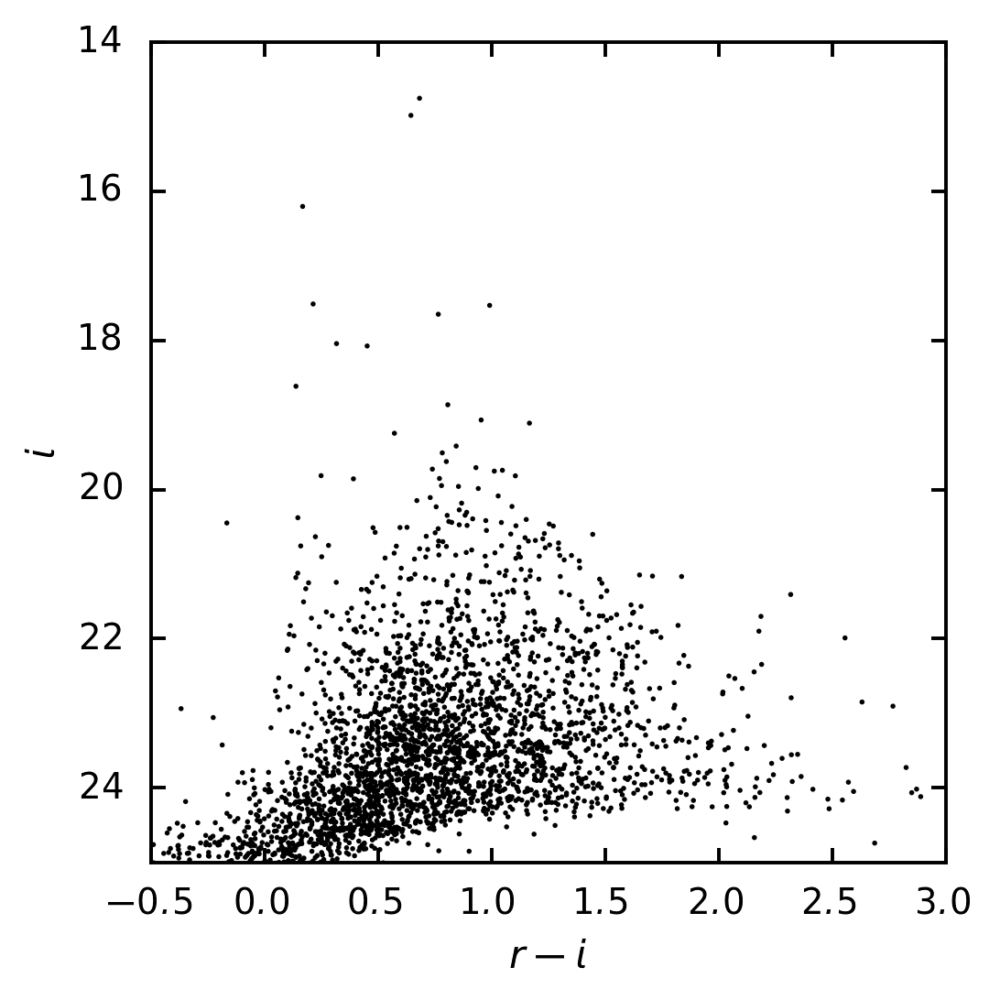

..
  Brief:
  This tutorial is geared towards beginners to the Science Pipelines software.
  Our goal is to guide the reader through a small data processing project to show what it feels like to use the Science Pipelines.
  We want this tutorial to be kinetic; instead of getting bogged down in explanations and side-notes, we'll link to other documentation.
  Don't assume the user has any prior experience with the Pipelines; do assume a working knowledge of astronomy and the command line.

#################################################################################
Getting started tutorial part 6: analyzing measurement catalogs in multiple bands
#################################################################################

In this part of the :ref:`tutorial series <getting-started-tutorial>` you'll analyze the forced photometry measurement catalogs you created in :doc:`step 5 <photometry>`.
You'll learn how to work with measurement tables and plot color-magnitude diagrams (CMDs).

Set up
======

Pick up your shell session where you left off in :doc:`part 5 <photometry>`.
That means your current working directory must *contain* the :file:`DATA` directory (the Butler repository).

The ``lsst_distrib`` package also needs to be set up in your shell environment.
See :doc:`/install/setup` for details on doing this.

As in :doc:`part 3 <display>`, you'll be working inside an interactive Python session for this tutorial.
You can use the default Python shell (:command:`python`), the `IPython shell`_, or even run from a `Jupyter Notebook`_.
Ensure that this Python session is running from the shell where you ran :command:`setup lsst_distrib`.

Loading forced photometry measurement catalogs with the Butler
==============================================================

The :command:`forcedPhotCoadd.py` command-line task (:ref:`getting-started-tutorial-forced-coadds`) created ``deepCoadd_forced_src`` datasets for each coadd in the example data repository.
Being forced photometry catalogs, rows in each ``deepCoadd_forced_src`` table correspond row-for-row across all coadds in different filters for a sky map patch.
Since you don't have to do additional cross-matching, these ``deepCoadd_forced_src`` datasets are convenient.

To get these datasets, open a Python session (`IPython`_ or `Jupyter Notebook`_) and create a Butler:

.. code-block:: python

   import lsst.daf.persistence as dafPersist
   butler = dafPersist.Butler(inputs='DATA/rerun/coaddForcedPhot')

This Butler is using the ``coaddForcedPhot`` rerun you created for the :command:`forcePhotCoadd.py` command-line task's outputs.

Next, use the Butler to get the ``deepCoadd_forced_src`` datasets for both filters:

.. code-block:: python

   rSources = butler.get('deepCoadd_forced_src', {'filter': 'HSC-R', 'tract': 0, 'patch': '1,1'})
   iSources = butler.get('deepCoadd_forced_src', {'filter': 'HSC-I', 'tract': 0, 'patch': '1,1'})

These datasets correspond to coadds for a single patch (``1,1`` in tract ``0``) for both the HSC-R and HSC-I filters.

Getting calibrated PSF photometry
=================================

The ``base_PsfFlux_flux`` column of these ``deepCoadd_forced_src`` datasets is the flux from the linear least-squares fit of the PSF model to the source.
From the source table's schema you know this flux has units of counts:

.. code-block:: python

   iSources.getSchema().find('base_PsfFlux_flux').field.getUnits()

Transforming this flux into a magnitude requires knowing the coadd's zeropoint, which you can get from the coadd dataset.
The coadd you made in :doc:`part 4 <coaddition>` with :command:`assembleCoadd.py` doesn't have calibration info attached to it, though.
Instead, you want the ``deepCoadd_calexp`` dataset, which was created by the :command:`detectCoaddSources.py` command-line task, because it does have calibrations.
You can access these calibrations directly from ``deepCoadd_calexp_calib`` datasets for each filter:

.. code-block:: python

   rCoaddCalib = butler.get('deepCoadd_calexp_calib',  {'filter': 'HSC-R', 'tract': 0, 'patch': '1,1'})
   iCoaddCalib = butler.get('deepCoadd_calexp_calib',  {'filter': 'HSC-I', 'tract': 0, 'patch': '1,1'})

.. note::

   An alternative way to get the ``lsst.afw.image.calib.Calib`` object is from the ``deepCoadd_calexp`` dataset object:

   .. code-block:: python

      rCoaddCalexp = butler.get('deepCoadd_calexp',  {'filter': 'HSC-R', 'tract': 0, 'patch': '1,1'})
      rCoaddCalib = rCoaddCalexp.getCalib()

These ``Calib`` objects not only have methods for directing accessing calibration information, but also for applying those calibrations.
Use the ``Calib.getMagnitude()`` method to transform fluxes in counts to magnitudes in the HSC instrument's system (AB magnitudes):

.. code-block:: python

   rCoaddCalib.setThrowOnNegativeFlux(False)
   iCoaddCalib.setThrowOnNegativeFlux(False)

   rMags = rCoaddCalib.getMagnitude(rSources['base_PsfFlux_flux'])
   iMags = iCoaddCalib.getMagnitude(iSources['base_PsfFlux_flux'])

.. note::

   The reason you called the ``Calib.setThrowOnNegativeFlux`` method was to prevent an exception from being raised for sources with negative fluxes.
   This is commonly required for forced photometry analysis since some sources may not be visible in a band so that the flux measurement is effectively of blank sky.
   Because of background variance, the measured flux of non-detections can be randomly negative.

Filtering for unique, deblended sources with the detect_isPrimary flag
======================================================================

Before going ahead and plotting a CMD from the full source table, you'll typically need to do some basic filtering.
Exactly what filtering is done depends on the application, but source tables should *always* be filtered for unique sources.
There are two ways that measured sources might not be unique: deblended sources, and sources in patch overlaps.

Finding deblended sources
-------------------------

When objects are detected, they are deblended.
Deblending involves decomposing a source into multiple child sources that have local flux peaks.
In source tables like ``rSources`` and ``iSources``, both the original (blended) *and* de-blended sources are included in the table.
This is done so that you can choose whether to use blended or deblended measurements in your analysis.
If you *don't* choose, though, the same flux will be included multiple times in your analysis.

Usually you will want to use fully-deblended sources in your analysis.
The best way to identify fully-deblended sources is those that have no children (*children* being sources deblended from that parent source) given the ``deblend_nChild`` column.
Make a boolean index array of deblended sources:

.. code-block:: python

   deblended = rSources['deblend_nChild'] == 0

Finding primary detections
--------------------------

The other reason a source in the table might not be unique is if it falls in the overlaps of patches.
Sources in overlaps appear in multiple measurement tables.

If you are analyzing multiple patches, or multiple tracts, you want to use the *primary* detection for each source.
The Pipelines determine if a detection in a patch is primary, or not, by whether it falls in the *inner region* of that patch (and tract).
An inner region is a part of a sky map exclusively claimed by one patch.

The flag that indicates whether a source lies in the patch's inner region isn't in the ``deepCoadd_forced_src`` table though.
Instead, you need to look at the ``deepCoadd_ref`` table made by :command:`mergeCoaddMeasurements.py` in the :ref:`previous tutorial <getting-started-tutorial-merge-coadds>`.

Begin by using the Butler to get the ``deepCoadd_ref`` dataset for  patch you're analyzing:

.. code-block:: python

   refTable = butler.get('deepCoadd_ref', {'filter': 'HSC-R^HSC-I', 'tract': 0, 'patch': '1,1'})

Then make an index array from the combination of ``detect_isPatchInner`` and ``detect_isTractInner`` flags:

.. code-block:: python

   inInnerRegions = refTable['detect_isPatchInner'] & refTable['detect_isTractInner']

The go-to flag: detect_isPrimary
--------------------------------

You actually want the combination of the ``isDeblended`` and ``inInnerRegions`` arrays you just made.
The ``deepCoadd_ref`` table provides a shortcut for this: the ``detect_isPrimary`` flag identifies sources that are both fully deblended and in inner regions.
Run:

.. code-block:: python

   isPrimary = refTable['detect_isPrimary']

Now you can use this array to slice the photometry arrays and get only primary sources, like this:

.. code-block:: python

   rMag[isPimary]
   iMag[isPimary]

.. note::

   The ``detect_isPrimary`` flag is defined by this algorithm:

   .. code-block:: text

      (deblend_nChild == 0) & detect_isPatchInner & detect_isTractInner

.. tip::

   You can learn about any table column from the schema.
   For example:

   .. code-block:: python

      refTable.schema.find('detect_isPrimary')

   You can get a list of all columns available in a table by running:

   .. code-block:: python

      refTable.schema.getNames()

Quickly classifying stars and galaxies
======================================

Reliably classifying sources as stars and galaxies is not easy, but you can get a rough estimate based on the *extendedness* of sources.
The ``base_ClassificationExtendedness_value`` column is ``1.`` for extended sources (galaxies) and ``0.`` for point sources (like stars).
To see this for yourself, run:

.. code-block:: python

   iSources.schema.find('base_ClassificationExtendedness_value').field.getDoc()

Go ahead and create a boolean index of sources classified as point sources:

.. code-block:: python

   isStellar = iSources['base_ClassificationExtendedness_value'] < 1.

Using measurement flags
=======================

Lastly, you may want to work with only high-quality measurements.
Earlier, you got PSF fluxes of sources (``base_PsfFlux_flux``).
The ``base_PsfFlux`` measurement plugin also creates flags that describe measurement errors and issues.
You can find these flags, as usual, from the table schema.
Here's a way to find columns produced by the ``base_PsfFlux`` plugin:

.. code-block:: python

   iSources.getSchema().extract('base_PsfFlux_*')

A useful flag is ``base_PsfFlux_flag``, which is the logical combination of specific ``base_PsfFlux`` error flags:

.. code-block:: python

   isGoodFlux = ~iSources['base_PsfFlux_flag']

Since the ``base_PsfFlux_flag`` is ``True`` for sources with measurement errors, you used the unary invert operator (``~``) so that well-measured sources are ``True`` in the ``isGoodFlux`` array.

Finally, combine all these boolean index arrays together:

.. code-block:: python

   selected = isPrimary & isStellar & isGoodFlux

In the next step, you'll plot a color-magnitude diagram of the sources you've selected.

Plot a CMD
==========

The product of this effort will be an *r-i* CMD.
You can use matplotlib_ to create this visualization:

.. code-block:: python

   import matplotlib.pyplot as plt

   plt.style.use('seaborn-notebook')
   plt.figure(1, figsize=(4, 4), dpi=140)
   plt.scatter(rMags[selected] - iMags[selected],
               iMags[selected],
               edgecolors='None', s=2, c='k')
   plt.xlim(-0.5, 3)
   plt.ylim(25, 14)
   plt.xlabel('$r-i$')
   plt.ylabel('$i$')
   plt.subplots_adjust(left=0.125, bottom=0.1)
   plt.show()

You should see a figure like this:

   r-i color-magnitude diagram of stars.

Wrap up
=======

In this tutorial, you gained experience working with source measurement catalogs created by the LSST Science Pipelines.
Here are some takeaways:

- Forced photometry source tables are ``deepCoadd_forced_src`` datasets.
  They're convenient to use because ``deepCoadd_forced_src`` tables from different filters (for a given sky map patch) correspond row-for-row.
- You need to filter sources for uniqueness due to deblending and patch overlaps.
  The ``detect_isPrimary`` column from the ``deepCoadd_ref`` dataset is the go-to flag for doing this.
- Use the ``base_ClassificationExtendedness_value`` column to quickly distinguish stars from galaxies.
- The ``base_PsfFlux_flag`` column is useful for identifying sources that don't have photometric measurement errors.

In the end, you created a simple *r-i* CMD.
This tutorial is just the beginning, though.
With the dataset you've created in this tutorial, you can look at galaxies with measurements from the ``CModel`` plugin.
Or compare PSF-fitted photometric measurements with aperture photometry of stars.

When you're ready, dive into the rest of the :doc:`LSST Science Pipelines </index>` documentation to begin processing your own data.
As you're learning, don't hesitate to reach out with questions on the `LSST Community forum`_.

.. _`Jupyter Notebook`: http://jupyter-notebook.readthedocs.io/en/latest/
.. _IPython:
.. _`IPython shell`: http://ipython.readthedocs.io/en/stable/
.. _matplotlib: http://matplotlib.org
.. _LSST Community forum: https://community.lsst.org
