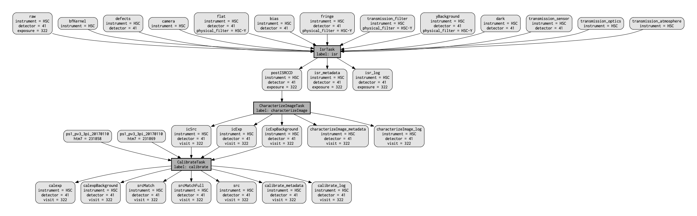

..
  Brief:
  This tutorial is geared towards beginners to data processing with the Science Pipelines.
  Our goal is to guide the reader through a small data processing project to show what it feels like to use the Science Pipelines.
  We want this tutorial to be kinetic; instead of getting bogged down in explanations and side-notes, we'll link to other documentation.
  Don't assume the user has any prior experience with the Pipelines; do assume a working knowledge of astronomy and the command line.

.. _getting-started-tutorial-singleframe:

##############################################################################
Getting started tutorial part 2: calibrating single frames with Pipeline Tasks
##############################################################################

In this part of the :ref:`tutorial series <getting-started-tutorial>` you'll process individual raw HSC images in the Butler repository (which you assembled in :doc:`part 1 <data-setup>`) into calibrated exposures.
We'll use the :command:`singleFrame` pipeline to remove instrumental signatures with dark, bias and flat field calibration images.
This will also use the reference catalog to establish a preliminary WCS and photometric zeropoint solution.

:ref:`Pipelines <pipe_base_creating_pipeline>` are defined in ``YAML`` files.
The example git repository contains a pipeline definition for data release processing that is only slightly modified from the one used in production processing of HSC data.
If you are interested in examining the pipeline defintions provided for this tutorial, look in ``$GEN3_RC2_SUBSET_DIR/pipelines/DRP.yaml``.

Set up
======

Pick up your shell session where you left off in :doc:`part 1 <data-setup>`.
For convenience, start in the top directory of the example git repository:

.. code-block:: bash

   cd $GEN3_DC2_SUBSET_DIR

The ``lsst_distrib`` package also needs to be set up in your shell environment.
See :doc:`/install/setup` for details on doing this.

Reviewing what data will be processed
=====================================

Pipeline tasks can operate on a single image or iterate over multiple images.
You can query for the data available to process using the :command:`butler` command line utility.

.. code-block:: bash

   butler query-data-ids SMALL_HSC --collections HSC/RC2/defaults --datasets 'raw'

The first few lines look something like:

.. code-block:: text

   band instrument detector physical_filter exposure
   ---- ---------- -------- --------------- --------
      y        HSC       41           HSC-Y      322
      y        HSC       42           HSC-Y      322
      y        HSC       47           HSC-Y      322
      y        HSC       49           HSC-Y      322

Notice the keys that describe each data ID, such as the ``exposure`` (exposure identifier for the HSC camera), ``detector`` (identifies a specific chip in the HSC camera), ``band`` (a generic specifier for about what part of the EM spectrum the filter samples) and ``physical_filter`` (the identifier of the specific implementation of this band for the HSC camera).
With these keys you can select exactly what data you want to process.
It's worth noting that the keys shown here are not the minimal ones needed to specify, for example, a ``raw``.
Only instrument+detector+exposure are necessary to uniquely identify a specific ``raw`` dataset, because the system knows that an exposure implies a physical_filter and a physical_filter implies a band.
The ``raw`` dataset is special in the sense that it is the starting point for all processing.
Images in the ``raw`` dataset have not had any processing applied to them and are as they arrive from the data aquisition system.

The important arguments are ``--collections`` and ``--datasets``.

The ``--collections`` argument allows you to select which data to search for data IDs.
You can see available collections by, again, using the :command:`butler` utility.

.. code-block:: bash

   butler query-collections SMALL_HSC

The ``--datasets`` argument allows you to specify what type of data to query for data IDs.
To ask the repository which values are available to pass, you can say:

.. code-block:: bash

   butler query-dataset-types SMALL_HSC

You can also filter the datasets you get back using the ``--where`` argument.
For example, here's how to select just ``HSC-I``-band datasets:

.. code-block:: bash

   butler query-data-ids SMALL_HSC --collections HSC/RC2/defaults --datasets 'raw' --where "physical_filter='HSC-I' AND instrument='HSC'"

Now only data IDs for ``HSC-I`` datasets are printed.

For instrument specific things like the filter, the instrument must be specified.
The instruments registered with a particular repository can be retrieved using the ``query-dimension-records`` subcommand of ``butler``.
E.g.:

.. code-block:: bash

   butler query-dimension-records SMALL_HSC/ instrument

There is only one instrument in this repository, so you only see metadata about that one instrument.
The result of the above command should look like this:

.. code-block:: bash
   name visit_max exposure_max detector_max            class_name
   ---- --------- ------------ ------------ -------------------------------
    HSC  21474800     21474800          200 lsst.obs.subaru.HyperSuprimeCam

For more information about the ``butler`` command line tool, try ``butler --help``.

Running single frame processing
===============================

.. tip::

   As mentioned in :doc:`part 1 <data-setup>`, this part of the processing is by far the most time consuming.
   If you do not wish to process all the data in the repository at this time, you can specify a data query that will reduce the number of exposures to be processed.
   Simply add the argument ``-d "instrument='HSC' AND detector=41 AND exposure=322"`` to the command line below.
   Data queries will be discussed in more detail later.

After learning about datasets, go ahead and run single frame processing  using the :command:`pipetask` command on all ``raw`` datasets in the repository:

.. code-block:: bash

   pipetask run -b $GEN3_RC2_SUBSET_DIR/SMALL_HSC/butler.yaml -p $GEN3_RC2_SUBSET_DIR/pipelines/DRP.yaml#singleFrame -i HSC/RC2/defaults -o u/$USER/single_frame --register-dataset-types

There are many arguments to command:``pipetask run``.
You can get useful information by saying command:``pipetask run --help``, but let's go over the ones listed here.

The ``-b`` option specifies which butler definition to use when constructing the ``Butler`` object to use in processing.

The ``-p`` option specifies which pipeline to run.
The full pipeline definition lives in the ``DRP.yaml`` file, but subtasks of the full processing can be run by specifying the subtask name with the ``#`` character, e.g. ``#singleFrame`` in this case.

The ``-i`` option indicates the input collections to use in processing.
You will learn more about collections later in this document.

The ``-o`` option defines the output collection to send the results of the processing to.
These tutorials suggest that you put the outputs in collections under a namespace defined by your username since that is unique for a given system.
In this case, there is little reason to be so careful because you are likely to have cloned into a space not shared with others.
However, it is good practice for times when you may be using a repository with a registry used by other users on the same system.

The ``--register-dataset-types`` switch tells the butler to register a dataset type if it doesn't already have a definition for it.
Because pipelines are allowed to define datasets at runtime, this switch is necessary if you expect products to be produced that are not already represented in the registry as in this case where we are producing calibrated exposures in a repository that contains only ``raw`` files.
If you expect that all of the dataset types should already be registiered, as is the case when processing another subset of data with a pipeline that has already been run, it can help catch unexpected behavior to remove that switch.

.. tip::

   It is not included in the above command, but the ``-j`` option is useful if you have more than one core available to you.
   Specifying ``-j<num cores>`` will run in parallel where ``<num cores>`` is the number of processes to execute in parallel.

   :ref:`Dataset queries <daf_butler_queries>` can be specified using the ``-d`` argument to specify which specific datasets should be considered when building the execution graph.
   If this argument is omitted, all data in the repository that can be processed based on other inputs, e.g. calibrations, will be.

Aside: collections and quantum graphs
============================================

:ref:`Collections <daf_butler_organizing_datasets>` are the primary way data in butler repositories are organized.
Of the types of collections available, the two of interest here are the ``RUN`` and ``CHAINED`` types.

``RUN`` collections are the least flexible.
Once a dataset is added to a ``RUN`` collection, it can never be moved to a different ``RUN`` collection.
The constraints on datasets in ``RUN`` collections makes these collections that most efficient to store and query.
The collection containing the raw data is a ``RUN`` collection.

``CHAINED`` collections are groupings of other collections associated with an alias for that grouping.
The grouping of collections defines the order of collections to search when looking for a dataset associated with a specific data ID.
The collection produced from the ``-o`` option above is a ``CHAINED`` collection.
The output collection will, in general, include all the collections in the input plus any ``RUN`` collections produced by the processing.

The first step of process data is to produce the quantum graph for the processing.
This is a directed acyclic graph that completely defines inputs and outputs for every node (quantum) in the graph.

Quantum graphs can be saved for reuse later, and diagnostic ``graphviz`` files can be used to visualize the quantum graph.
The ``qgraph`` subcommand to ``pipetask`` can be used to generate the quantum graph without doing any further processing.
The full processing produces a quantum graph that has many nodes and is hard to look at on one page.
There is a simplified version of the pipeline that is not sufficient for other pipelines, but that does produce a simple enough quantum graph to easily be viewed on one page.
It is called ``simpleSingleFrame``.
Try building the quantum graph for the processing of a single detector:

.. code-block:: bash

   pipetask qgraph -b $GEN3_RC2_SUBSET_DIR/SMALL_HSC/butler.yaml -p $GEN3_RC2_SUBSET_DIR/pipelines/DRP.yaml#simpleSingleFrame -i HSC/RC2/defaults -o u/$USER/single_frame -d "instrument='HSC' AND detector=41 AND exposure=322" --qgraph-dot single_frame.dot --save-qgraph single_frame.qgraph

The quantum graph is saved in ``pickle`` format in the file called ``single_frame.qgraph``.
The ``graphviz`` file is in ``single_frame.dot``.
If you have ``graphviz`` installed, you can turn the ``dot`` file into something you look at via a command like this:

.. code-block:: bash

   dot -Tpdf -osingle_frame.pdf single_frame.dot

This should produce something similar to the following figure.

   A visualization of the quantum graph generated in this section.

Wrap up
=======

In this tutorial, you've used the :command:`pipetask run` command to calibrate ``raw`` images in a Butler repository.
Here are some key takeaways:

- The :command:`pipetask run` command, with appropriate arguments and switches, processes ``raw`` datasets, applying both photometric and astrometric calibrations.
- Datasets are described by both a *type* and *data ID*.
  Data IDs are key-value pairs that describe a dataset (for example ``filter``, ``visit``, ``ccd``, ``field``).
- :ref:`Dataset queries <daf_butler_queries>` can be used to specify which datasets to process..
- Pipelines write their outputs to a Butler data repository.
  Collections are used to organize and associate outputs of processing with the inputs to the processing.

Continue this tutorial in :doc:`part 3, where you'll learn how to display these calibrated exposures <display>`.
